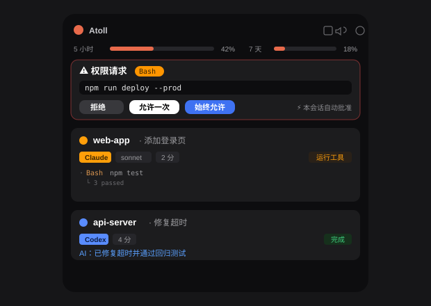
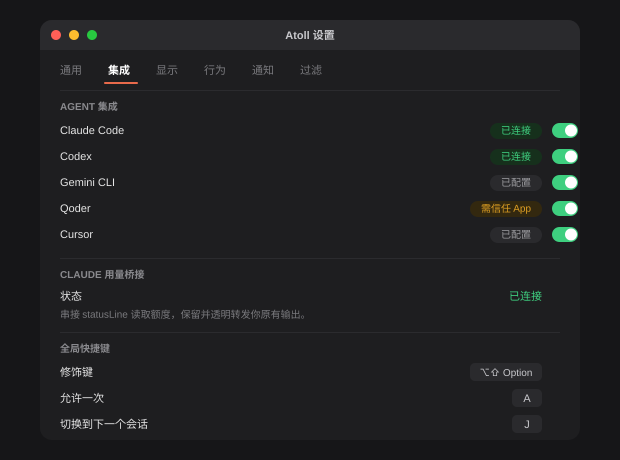

# 🪸 Atoll

**A macOS Dynamic Island for your AI coding agents.** Monitor multiple agent sessions (Claude Code, Codex, Gemini…) in a floating panel at the top of your screen, and approve permission requests, answer questions, and review plans right there — without switching back to the terminal.

Runs fully local: no cloud, no account, no telemetry.

*[中文](README.md)*

<p align="center">
  
  <br>
  
  <br>
  <sub>Illustrative, with placeholder data.</sub>
</p>

---

## Features

- **Multi-agent monitoring** — all sessions in one list: state (thinking / running tool / compacting / waiting for approval / done…), live tool stream with result summaries (`└ 3 passed`), task-list progress, subagent aggregation, project name / model / elapsed. Color-coded per agent (Claude orange / Codex blue / Gemini cyan / Qoder purple / Cursor green).
- **Approve in the island** — permission cards (allow once / always allow / deny, with diff and file preview), AskUserQuestion (single/multi-select, multi-question wizard), Plan review (Markdown + feedback). **If the app crashes or quits, requests fall back to the terminal's native flow** — an agent is never stuck.
- **Precise terminal jump** — click a session card to jump back to its iTerm2 / Terminal tab.
- **Zero-config + hook watcher** — one-command install/uninstall of each CLI's hooks (non-destructive merge, coexists with other tools); auto-restores hooks if another tool strips them.
- **Usage meters** — Claude 5-hour / 7-day rate-limit usage and reset countdown at the top of the panel (statusLine bridge; your existing statusLine output is unchanged).
- **Smart session titles** — reuses Claude Code's built-in AI session naming.
- **Notifications and noise control** — separate approval / question / subagent-completion / task-completion / failure controls, system banners, event sounds, custom sound packs, completion coalescing, foreground-agent suppression, quiet hours, session-lock/wake suppression, and display-mirroring silence.
- **Display and interaction** — monitor selection, compact/detailed collapsed styles, hover delay, fullscreen hiding, click-to-jump, and foreground completion suppression.
- **SSH remote** — run agents on a remote server, monitor and approve locally (reverse tunnel).
- **Global shortcuts** — ⌥⇧A approve / ⌥⇧D deny / ⌥⇧P toggle panel.

## Supported agents

| Agent | Monitor | Approve | Notes |
|-------|:-------:|:-------:|-------|
| Claude Code (CLI) | ✅ | ✅ | Full support |
| Codex (CLI) | ✅ | ✅ | Desktop app needs to trust hooks in-app |
| Gemini CLI | ✅ | — | Native hooks; monitoring only |
| Qwen Code | ✅ | ✅ | Claude-compatible hooks, distinct source IDs |
| Factory / CodeBuddy | ✅ | ✅ | Claude-compatible hooks, distinct source IDs |
| Kimi CLI | ✅ | — | Native TOML hook configuration |
| Cursor | ✅ | — | Native flat hook format |
| OpenCode | ✅ | ✅ | Native plugin events and permission replies |
| QoderWork | — | — | Current version doesn't execute external hooks |

> **Note:** **Codex Desktop** gates hooks by identity and needs Atoll's hooks trusted in-app (see Settings → Integrations). **QoderWork (~0.9.12)** parses a hooks config but does not execute hook commands (verified with a plain-shell canary), so it can't be integrated yet — pending a future version. CLI versions have no such restriction.

## Requirements

- macOS 14+
- Build: Xcode / Swift 5.10+, Go 1.22+

## Install

```sh
git clone <repo-url> ~/atoll && cd ~/atoll

# Build and install to /Applications
scripts/build-app.sh --install

# Install hooks for each CLI (non-destructive, auto-backup)
python3 scripts/install-hooks.py

# Launch (the island appears at the top center of the screen)
open -a Atoll
```

Uninstall hooks: `python3 scripts/install-hooks.py --remove`

## Usage

- Hover the floating bar at the top center → the panel expands; move away → it collapses.
- When an agent needs approval, the panel pops open with a card — click a button or use a shortcut.
- Resolving an approval in either Atoll or the agent clears the same request on the other side; `tool_use_id` is used when available.
- Settings → Integrations offers per-agent approval routing: Follow Focus / Atoll / Native. Follow Focus delegates to the native surface when that agent app or its terminal is frontmost; otherwise Atoll handles it, preventing sequential duplicate prompts.
- Right-click a session to remove it from Atoll, or use the header trash button to clear finished sessions. This affects local presentation only; it never terminates or deletes the underlying agent task, and pending interactions are protected.
- The **⚙ gear** in the panel header opens Settings (General / Integrations / Display / Behaviour / Notifications / Filter).
- While an agent is working, the coral 🪸 in the panel gently bobs.

## Architecture

```
agent CLI hook → atoll-bridge (Go binary) → 127.0.0.1:<random port> gateway (in the Swift app) → notch panel
                                                    ↑ token auth, localhost only
```

- `bridge/` — Go hook shim: reads the stdin payload, forwards to the local gateway; approval events hold for the decision; exits silently if the gateway is down (never blocks the agent).
- `app/` — Swift macOS app (SPM): NWListener HTTP gateway + session state machine + SwiftUI notch panel; no Dock or menu-bar icon.
- `scripts/` — `install-hooks.py` (hook install/uninstall), `build-app.sh` (package the .app), `atoll-ssh.sh` (SSH remote).

## Security

Fully local, bound to `127.0.0.1` only, random-token auth, no outbound network, no telemetry. See [SECURITY.md](SECURITY.md).

## Development

```sh
(cd app && swift build && .build/debug/Atoll)   # run the debug build
(cd app && swift test)                          # Swift unit/regression tests
(cd bridge && go test ./...)                    # Go bridge unit tests
scripts/self-test.sh                            # local end-to-end self-test
```

## Known limitations

- **Desktop-app trust gate**: sandboxed desktop apps (Codex Desktop / QoderWork) require trusting hooks in-app; Atoll cannot self-authorize programmatically (see above).
- **ExitPlanMode**: the final plan approval must be confirmed in the terminal (the current Claude Code version doesn't honor a hook's allow for it).
- Precise terminal jump currently covers iTerm2 / Terminal.app.

## License

[MIT](LICENSE) © 2026 mk
