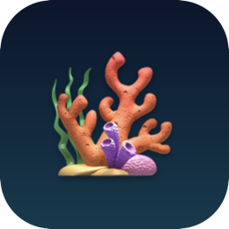
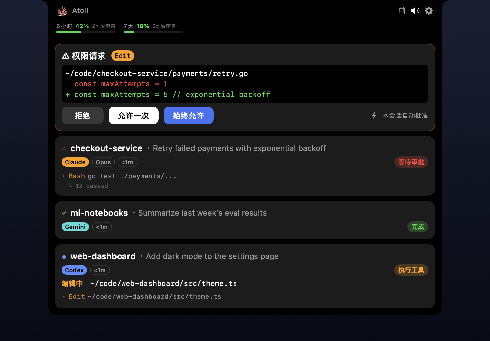
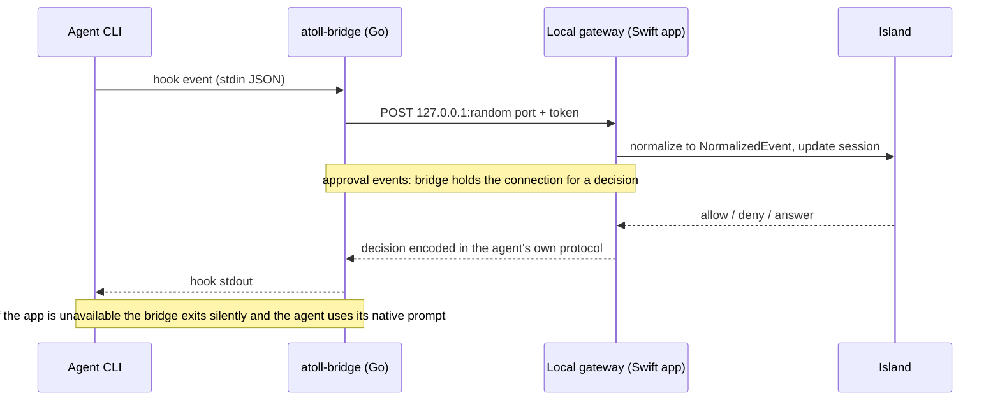

<p align="center">
  
</p>

<h1 align="center">Atoll</h1>

<p align="center">
  <b>A macOS Dynamic Island for your AI coding agents.</b><br>
  Claude Code, Codex, Gemini and friends, all in one floating island at the top of your screen —<br>
  approve permissions, answer questions and review plans right there, without switching back to the terminal.
</p>

<p align="center">
  <a href="https://github.com/TaylorChen/atoll/actions/workflows/ci.yml"></a>
  <a href="https://github.com/TaylorChen/atoll/releases/latest"></a>
  
  
  <a href="LICENSE"></a>
</p>

<p align="center">
  <a href="https://github.com/TaylorChen/atoll/releases/latest"><b>Download</b></a> ·
  <a href="#quick-start">Quick start</a> ·
  <a href="#supported-agents">Supported agents</a> ·
  <a href="#how-it-works">How it works</a> ·
  <a href="README.md">中文</a>
</p>

<p align="center">
  
</p>

<p align="center">
  
  <br>
  <sub>Collapsed, it's just a small island: current action + session count. Hover to expand, move away to collapse.<br>Screenshots are rendered off-screen from the real SwiftUI views with placeholder data (<code>scripts/render-screenshots.sh</code>).</sub>
</p>

> **Note:** the UI is currently Chinese-only. Contributions for English localization are very welcome.

---

## Why Atoll

When you run three or four agents at once, the bottleneck usually isn't the model — it's **not noticing that an agent is waiting on you**. A permission prompt sits in some terminal tab for ten minutes while another agent finished long ago.

Atoll gathers every agent's state into one small island at the top of the screen:

- **See everything at a glance** — who's thinking, who's running a tool, who's waiting for approval, who's done.
- **Decide in place** — approval cards show the diff and a file preview; click, or press ⌥⇧A, without hunting for the terminal.
- **Stays out of the way** — fully local, no account, no telemetry. If Atoll quits or crashes, agents fall back to their native terminal prompts — never stuck.

## Features

- **Multi-agent monitoring** — state (thinking / running tool / compacting / waiting for approval / done…), live tool stream with result summaries (`└ 12 passed`), task-list progress, subagent aggregation, project / model / elapsed, color-coded per agent.
- **Approve in the island** — permission cards (allow once / always allow / deny, with diff and file preview), AskUserQuestion (single/multi-select, multi-question wizard), Plan review (Markdown + feedback).
- **Smart approval routing** — per agent: Follow Focus / Atoll / Native. When the agent itself is frontmost its native prompt handles it, so you never get two prompts in a row.
- **Precise terminal jump** — click a session card to jump back to its iTerm2 / Terminal tab.
- **Integration center + hook watcher** — toggle each agent's hooks from Settings (non-destructive merge, coexists with other tools, backed up first); hooks are restored if another tool strips them.
- **Usage meters** — Claude 5-hour / 7-day rate-limit usage and reset countdown (statusLine bridge; your existing output is unchanged).
- **Notifications and noise control** — per-kind toggles for approvals / questions / subagent completion / task completion / failures; system banners, event sounds, custom sound packs, completion coalescing, foreground-agent suppression, quiet hours, lock / wake / screen-mirroring silence.
- **Display** — monitor selection, physical-notch aware geometry, compact / detailed collapsed styles, hover delay, fullscreen hiding.
- **SSH remote** — run agents on a remote server, monitor and approve locally (reverse tunnel).
- **Global shortcuts** — ⌥⇧A approve / ⌥⇧D deny / ⌥⇧P toggle panel.

## Supported agents

| Agent | Monitor | Approve | Notes |
|-------|:-------:|:-------:|-------|
| Claude Code (CLI) | ✅ | ✅ | Full support |
| Codex (CLI / Desktop) | ✅ | ✅ | Desktop app needs to trust hooks in-app |
| OpenCode | ✅ | ✅ | Native plugin events and permission replies |
| Qwen Code | ✅ | ✅ | Claude-compatible hooks, distinct source ID |
| Factory / CodeBuddy | ✅ | ✅ | Claude-compatible hooks, distinct source IDs |
| Gemini CLI | ✅ | — | Native hooks; monitoring only |
| Kimi CLI | ✅ | — | Native TOML hook configuration |
| Cursor | ✅ | — | Native flat hook format |
| Pi | ✅ | — | Native TypeScript extension; monitoring only |
| QoderWork | ✅ | — | Claude-compatible hooks (`~/.qoderwork/settings.json`); monitoring only |

> **Note:** **Codex Desktop** gates hooks by identity and needs Atoll's hooks trusted in-app (Settings → Integrations). **QoderWork (tested on 0.9.18)** reads hooks only when a task session starts, so start a new task after enabling the integration.

## Quick start

### Option 1: download the prebuilt app

1. Download the zip from [Releases](https://github.com/TaylorChen/atoll/releases/latest), unzip, and drag `Atoll.app` into `/Applications`.
2. The app is ad-hoc signed (not notarized by Apple), so clear the quarantine flag before the first launch:
   ```sh
   xattr -dr com.apple.quarantine /Applications/Atoll.app
   ```
3. `open -a Atoll` — the island appears at the top center of the screen.
4. Hover to expand → ⚙ gear → **Integrations** (集成), and enable the agents you use. New agent sessions will show up on the island.

### Option 2: build from source

Requires Xcode 16+ (Swift 6) and Go 1.26+.

```sh
git clone https://github.com/TaylorChen/atoll.git ~/atoll && cd ~/atoll
scripts/build-app.sh --install     # release build, installed to /Applications
open -a Atoll
```

Hooks can also be installed / removed from the command line, without the app:

```sh
python3 scripts/install-hooks.py            # non-destructive, auto-backup
python3 scripts/install-hooks.py --remove   # uninstall
```

## Usage

- Hover the island at the top center → the panel expands; move away → it collapses.
- When an agent needs approval, the panel pops open with a card — click a button or use a shortcut.
- Resolving an approval in either Atoll or the agent clears the same request on the other side; `tool_use_id` is used when available.
- Right-click a session to remove it from Atoll, or use the header trash button to clear finished sessions. This only affects Atoll's display; it never terminates or deletes the agent's task, and pending requests are protected.
- The **⚙ gear** in the panel header opens Settings (General / Integrations / Display / Behaviour / Notifications / Filter).

## How it works


```mermaid
sequenceDiagram
    participant A as Agent CLI
    participant B as atoll-bridge (Go)
    participant G as Local gateway (Swift app)
    participant U as Island
    A->>B: hook event (stdin JSON)
    B->>G: POST 127.0.0.1:random port + token
    G->>U: normalize to NormalizedEvent, update session
    Note over B,G: approval events: bridge holds the connection for a decision
    U-->>G: allow / deny / answer
    G-->>B: decision encoded in the agent's own protocol
    B-->>A: hook stdout
    Note over A,B: if the app is unavailable the bridge exits silently and the agent uses its native prompt
```

- `bridge/` — Go hook shim: reads the stdin payload and forwards it to the local gateway; approval events hold for the decision; exits silently if the gateway is down, so it never blocks the agent.
- `app/` — Swift macOS app (SPM): NWListener HTTP gateway + session state machine + SwiftUI island; no Dock or menu-bar icon.
- `scripts/` — `install-hooks.py` (hook install / uninstall), `build-app.sh` (package the .app), `atoll-ssh.sh` (SSH remote), `render-screenshots.sh` (regenerate README screenshots).

Hook protocols differ per agent (Claude-compatible JSON, Codex-specific decisions, native Cursor / Gemini events, Kimi TOML, an OpenCode plugin, a Pi extension); see [AGENTS.md](AGENTS.md) for the details.

## Security and privacy

Bound to `127.0.0.1` only, random-token auth, no outbound network, no telemetry, no account. Hook configs are backed up before changes and can be removed in one step. See [SECURITY.md](SECURITY.md).

## Known limitations

- **UI language**: Chinese only for now.
- **Desktop-app trust gate**: sandboxed desktop apps such as Codex Desktop require trusting hooks in-app; Atoll cannot self-authorize.
- **ExitPlanMode**: the final plan approval must be confirmed in the terminal (the current Claude Code version doesn't honor a hook's allow for it).
- **Terminal jump**: precise jump currently covers iTerm2 / Terminal.app.
- **Signing**: release builds are ad-hoc signed and not notarized.

## Contributing

Issues and PRs are welcome — especially new agent integrations and terminal-jump support. See [CONTRIBUTING.md](CONTRIBUTING.md) for the workflow and checks.

## License

[MIT](LICENSE) © 2026 mk
