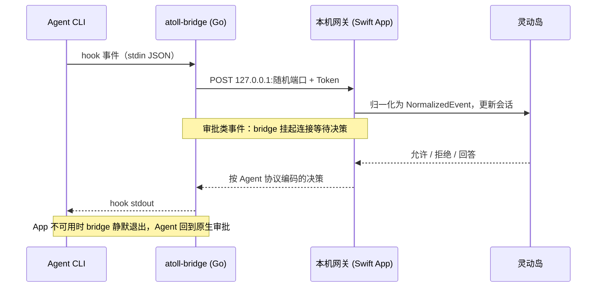

<p align="center">
  
</p>

<h1 align="center">Atoll</h1>

<p align="center">
  <b>为 AI 编程 Agent 打造的 macOS 灵动岛。</b><br>
  Claude Code、Codex、Gemini 等多个 Agent 的会话集中在屏幕顶部——<br>
  直接在灵动岛里批准权限、回答问题、审阅计划，不用切回终端。
</p>

<p align="center">
  <a href="https://github.com/TaylorChen/atoll/actions/workflows/ci.yml"></a>
  <a href="https://github.com/TaylorChen/atoll/releases/latest"></a>
  
  
  <a href="LICENSE"></a>
</p>

<p align="center">
  <a href="https://github.com/TaylorChen/atoll/releases/latest"><b>下载</b></a> ·
  <a href="#快速开始">快速开始</a> ·
  <a href="#支持的-agent">支持的 Agent</a> ·
  <a href="#工作原理">工作原理</a> ·
  <a href="README.en.md">English</a>
</p>

<p align="center">
  
</p>

<p align="center">
  
  <br>
  <sub>收起时只是一条小岛：当前动作 + 会话数。悬停展开，移开收起。<br>截图由真实 SwiftUI 视图离屏渲染，数据为占位（<code>scripts/render-screenshots.sh</code>）。</sub>
</p>

---

## 为什么需要 Atoll

同时跑三四个 Agent 时，真正卡住进度的往往不是模型，而是**你没注意到它在等你**：某个终端标签里的权限请求停了十分钟，另一个早就跑完了。

Atoll 把所有 Agent 的状态收进屏幕顶部的一个小岛：

- **一眼看全局**——谁在思考、谁在跑工具、谁在等审批、谁已完成。
- **就地决策**——审批卡带 diff 和文件预览，点一下或按 ⌥⇧A 放行，不用找终端。
- **不添乱**——纯本地、无账号、无遥测；App 退出或崩溃时，Agent 自动退回终端原生审批，绝不卡死。

## 功能

- **多 Agent 监控**：状态（思考 / 执行工具 / 压缩 / 等待审批 / 完成…）、工具调用流水与结果摘要（`└ 12 passed`）、任务清单进度、子 Agent 聚合、项目名 / 模型 / 耗时，按 Agent 配色区分。
- **灵动岛内批准**：权限请求卡（允许一次 / 始终允许 / 拒绝，带 diff 与文件预览）、AskUserQuestion 单选 / 多选 / 多题向导、Plan 审阅（Markdown + 反馈）。
- **智能审批路由**：每个 Agent 可选“跟随焦点 / Atoll / 原生”。Agent 自己在前台时交给原生界面，避免两个审批框依次弹出。
- **终端精确跳转**：点击会话卡跳回它所在的 iTerm2 / Terminal 标签。
- **集成中心 + Hook 守护**：设置里一键开关各 Agent 的 hooks（非破坏性 merge，与其他工具共存，改前备份）；hooks 被外部移除时自动恢复。
- **用量额度**：显示 Claude 5 小时 / 7 天 rate-limit 用量与重置倒计时（statusLine 桥接，不改你原有输出）。
- **通知与降噪**：审批 / 回答 / 子 Agent 完成 / 任务完成 / 错误独立开关；系统横幅、事件音、自定义声音包、完成合并、前台 Agent 抑制、静默时段、锁屏 / 唤醒 / 屏幕镜像静默。
- **显示与交互**：显示器选择、物理刘海自适应、紧凑 / 详细收起样式、悬停延迟、全屏隐藏。
- **SSH 远程**：Agent 跑在远端服务器，本地监控与审批（反向隧道）。
- **全局快捷键**：⌥⇧A 批准 / ⌥⇧D 拒绝 / ⌥⇧P 展开收起面板。

## 支持的 Agent

| Agent | 监控 | 审批 | 说明 |
|-------|:----:|:----:|------|
| Claude Code (CLI) | ✅ | ✅ | 完整支持 |
| Codex (CLI / Desktop) | ✅ | ✅ | 桌面版需在应用内信任 hooks |
| OpenCode | ✅ | ✅ | 原生插件事件与审批回复 |
| Qwen Code | ✅ | ✅ | Claude 兼容 Hook，独立标识 |
| Factory / CodeBuddy | ✅ | ✅ | Claude 兼容 Hook，独立标识 |
| Gemini CLI | ✅ | — | 原生 Hook，仅监控 |
| Kimi CLI | ✅ | — | 原生 TOML Hook 配置 |
| Cursor | ✅ | — | 原生扁平 Hook 格式 |
| QoderWork | — | — | 当前版本不执行外部 hooks，暂无法接入 |

> **注意**：**Codex Desktop** 等沙箱化桌面应用按 hook 身份做信任门控，需要在应用内信任 Atoll 的 hooks（详见设置 → 集成）。**QoderWork（约 0.9.12）** 会解析 hooks 配置但不执行 hook 命令（已用纯 shell 探针验证），待其后续版本支持。

## 快速开始

### 方式一：下载预构建 App

1. 从 [Releases](https://github.com/TaylorChen/atoll/releases/latest) 下载 zip，解压后把 `Atoll.app` 拖进 `/Applications`。
2. App 目前为 ad-hoc 签名（未经 Apple 公证），首次打开前移除隔离属性：
   ```sh
   xattr -dr com.apple.quarantine /Applications/Atoll.app
   ```
3. `open -a Atoll`，屏幕顶部中央出现小岛。
4. 悬停展开 → ⚙ 齿轮 → **集成**，打开你在用的 Agent。之后新开的 Agent 会话就会出现在岛上。

### 方式二：从源码构建

需要 Xcode 16+（Swift 6）与 Go 1.26+。

```sh
git clone https://github.com/TaylorChen/atoll.git ~/atoll && cd ~/atoll
scripts/build-app.sh --install     # Release 构建并安装到 /Applications
open -a Atoll
```

也可以不经 App、直接用命令行安装 / 卸载 hooks：

```sh
python3 scripts/install-hooks.py            # 非破坏性安装，自动备份
python3 scripts/install-hooks.py --remove   # 卸载
```

## 使用

- 悬停屏幕顶部中央的小岛 → 展开面板；鼠标移开自动收起。
- Agent 需要审批时，面板自动弹出审批卡，点按钮或用快捷键决策。
- Atoll 或 Agent 任一侧完成审批后，另一侧的同一请求同步结束；优先按 `tool_use_id` 精确关联。
- 会话卡右键可“从 Atoll 移除”，顶栏垃圾桶可批量清理已完成会话；只清理本地展示，不终止或删除 Agent 原始任务。待处理请求不可移除。
- 面板顶栏 **⚙ 齿轮**打开设置（通用 / 集成 / 显示 / 行为 / 通知 / 过滤）。

## 工作原理



- `bridge/` — Go hook shim：读 stdin payload 转发给本地网关；审批类事件挂起等决策；网关不可用时静默退出，不阻断 Agent。
- `app/` — Swift macOS App（SPM）：NWListener HTTP 网关 + 会话状态机 + SwiftUI 灵动岛；不占 Dock 与菜单栏。
- `scripts/` — `install-hooks.py`（hooks 安装 / 卸载）、`build-app.sh`（打包 .app）、`atoll-ssh.sh`（SSH 远程）、`render-screenshots.sh`（重新生成 README 截图）。

各 Agent 的 Hook 协议并不相同（Claude 兼容 JSON、Codex 专用决策结构、Cursor / Gemini 原生事件、Kimi TOML、OpenCode 插件），差异和调研记录见 [AGENTS.md](AGENTS.md)。

## 安全与隐私

只绑定 `127.0.0.1`，随机 Token 鉴权，不出网，无遥测，无账号。hooks 安装前自动备份，可一键卸载。详见 [SECURITY.md](SECURITY.md)。

## 已知限制

- **界面语言**：目前仅中文。
- **桌面应用信任门控**：Codex Desktop 等沙箱应用需在应用内信任 hooks，Atoll 无法程序化自我授权。
- **ExitPlanMode**：计划的最终批准需在终端确认（当前 Claude Code 版本对 hook 的 allow 不采纳）。
- **终端跳转**：精确跳转目前覆盖 iTerm2 / Terminal.app。
- **签名**：发布包为 ad-hoc 签名，未经 Apple 公证。

## 参与贡献

欢迎 Issue 和 PR，尤其是新 Agent 的接入与终端跳转支持。开发流程与验证命令见 [CONTRIBUTING.md](CONTRIBUTING.md)。

## License

[MIT](LICENSE) © 2026 mk
